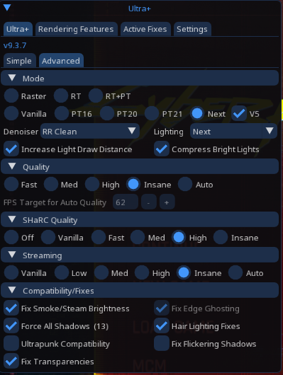

  [ Installation |
  <a href="https://github.com/BudddyDudeGuy/Cyberpunk_2077-Modlist/blob/main/GAMEPLAY.md">Gameplay Guide</a> |
  <a href="https://github.com/BudddyDudeGuy/Cyberpunk_2077-Modlist/blob/main/Changelog.md">Changelog</a> |
  <a href="https://github.com/BudddyDudeGuy/Cyberpunk_2077-Modlist/issues">Issues</a> ]

---

>[!IMPORTANT]
>Night City Refined requires the **Phantom Liberty** expansion and the free **REDmod** DLC. The list will not install or run without both of them.

>[!WARNING]
>Read this ReadMe in full before installing. Nearly every failed install and broken first launch comes down to a step that was skipped.

<header>
    <h1>Contents</h1>
</header>

- [Introduction](#introduction)
  - [System Requirements](#system-requirements)
- [Installation](#installation)
  - [Pre-Installation](#pre-installation)
    - [Installing REDmod](#installing-redmod)
    - [Clean Install](#clean-install)
    - [If You Have Modded the Game Before](#if-you-have-modded-the-game-before)
  - [Wabbajack Installation](#wabbajack-installation)
    - [Installing Wabbajack](#installing-wabbajack)
    - [Downloading and Installing the Modlist](#downloading-and-installing-the-modlist)
- [Playing the List](#playing-the-list)
  - [Launching the Game](#launching-the-game)
  - [First Time Game Startup](#first-time-game-startup)
  - [Optional Setup](#optional-setup)
- [Updating the Modlist](#updating-the-modlist)
- [Removing the Modlist](#removing-the-modlist)
- [Issues](#issues)
- [Credits and Thanks](#credits-and-thanks)

# Introduction

Night City Refined is a [Wabbajack](https://www.wabbajack.org/) modlist for Cyberpunk 2077, and it is exactly what the name says: Cyberpunk 2077, refined. Better driving, guns, enemies, quests, economy, and a lot more. In-game files were adjusted by hand and mods were curated from a lot of talented authors to improve the gameplay loops, fix bugs, and add quality of life features.

The vision for this list is to refine what is already in the game, not to pile on every new car, gun, and outfit on Nexus. It fixes the gameplay loops, combat, enemies, driving, and the rest of what vanilla shipped, without obstructing Cyberpunk 2077's gameplay and lore. It is meant to be as immersive and lore friendly as possible, with combat that is challenging but still balanced. My brother and I have played and re-played it over hundreds of hours and several full playthroughs, and it is as stable, performance friendly, and bug free as we could get it.

Beyond gameplay, the list brings substantial improvements to visuals and performance through carefully selected graphics and optimization mods. Ray tracing and path tracing are heavily optimized and paired with LUTs from some excellent authors, so the game looks better and runs better at the same time.

A summary of the mods that actually change the gameplay loops, balancing, and other key parts of the game is on the [Gameplay Guide](https://github.com/BudddyDudeGuy/Cyberpunk_2077-Modlist/blob/main/GAMEPLAY.md).

## System Requirements

Night City Refined follows the base Cyberpunk 2077 system specs.

| | Minimum (1080p Low) | Recommended (1080p High) |
|---|---|---|
| **OS** | Windows 10/11 64-bit | Windows 10/11 64-bit |
| **CPU** | i7-6700 / R5 1600 | i7-12700 / R5 7600 |
| **RAM** | 12 GB | 16 GB |
| **GPU** | GTX 1060 6GB / RX 580 | RTX 3060 / RX 5700 XT |
| **Storage** | SSD, ~150 GB free | NVMe SSD, ~150 GB free |

>[!WARNING]
>An SSD is **required**. Mod loading and asset streaming will stutter or crash on a mechanical hard drive.

# Installation

Follow the steps below to install the modlist and prepare your game for an enhanced Cyberpunk 2077 experience. If you are updating an existing install, skip to the [updating section](#updating-the-modlist).

## Pre-Installation

These steps are only required the first time you install the list.

### Installing REDmod

REDmod is a free DLC and the list will not work without it. On Steam, open the DLC page for Cyberpunk 2077 and download it from there. The process is the same on the other storefronts.

### Clean Install

>[!WARNING]
>Start from a clean, unmodded copy of Cyberpunk 2077, especially if you have installed mods before. Leftover files are the most common cause of conflicts and failed launches.

 1. Reinstall Cyberpunk 2077, or verify that your current install has never been modded.

 2. Press `Win Key + R`, type `%appdata%`, and hit `ENTER`.

    

 3. Go up one level into `AppData\Local` and delete the `CD Projekt Red` and `REDEngine` folders. This clears the cached config files so they cannot conflict with the list.

    

### If You Have Modded the Game Before

 1. Go to your main Cyberpunk 2077 directory and delete the `bin`, `engine`, `r6`, and `red4ext` folders.

    

 2. Delete the `mod` folder in `Cyberpunk 2077\archive\pc\`.

    

 3. Verify your game files through your launcher (Steam, GOG, Epic). This restores every core file you just deleted and guarantees a clean base for the list.

## Wabbajack Installation

### Installing Wabbajack

 1. Create an empty folder named `Wabbajack` on the root of your drive, such as `C:\Wabbajack`.
    > **DO NOT** place it in Program Files, in User folders (Desktop, Documents, Downloads, OneDrive, etc.), in your Cyberpunk 2077 game folder, or in any folder related to the modlist itself (the downloads or install folder).

 2. Download the [latest version of Wabbajack](https://www.wabbajack.org/) and place `Wabbajack.exe` inside the folder you created in Step 1.

    

 3. Double-click `Wabbajack.exe` to set the program up.

### Downloading and Installing the Modlist

Downloading and installing the list can take a while depending on your internet connection, PC specs, and whether you have Nexus Premium. Without Premium you will need to click the **Slow Download** button for each mod manually.

 1. Download [`Night City Refined.wabbajack`](https://github.com/BudddyDudeGuy/Cyberpunk_2077-Modlist/releases/latest/download/Night.City.Refined.wabbajack) from the [Releases](https://github.com/BudddyDudeGuy/Cyberpunk_2077-Modlist/releases/latest) page.

 2. Open Wabbajack, click the gear icon in the top right, and press the Nexus login button to link your account. Every mod is pulled from Nexus, so this step is not optional.

    

 3. Select `Install from disk` and set the target modlist path to the `Night City Refined.wabbajack` file you downloaded in Step 1.

 4. Set the `Modlist Installation Location` to a folder such as `C:\Modlist`. It can go anywhere you like.
    > **DO NOT** place it in Program Files, in User folders (Desktop, Documents, Downloads, OneDrive, etc.), or in your Cyberpunk 2077 game folder.

 5. Set the `Downloads Location` wherever you like. Keeping it inside the install location, such as `C:\Modlist\Downloads`, is the easiest option.

    

 6. Press the play arrow to begin the download and install.

# Playing the List

Cyberpunk 2077 always has to be launched through Mod Organizer 2. Launching the game from Steam, GOG, Epic, or a desktop shortcut to the game executable will start it unmodded.

## Launching the Game

 1. Open your modlist folder and run `ModOrganizer.exe`.

 2. In the upper right of Mod Organizer 2 there is a dropdown menu beside the `RUN` button. Select `Cyberpunk 2077` and click `RUN`.

>[!CAUTION]
>A window will pop up with an `Unlock` button. **DO NOT click Unlock.** Give the game time to launch. Never click `Unlock` while playing the list, it will break the game.

>[!TIP]
>If you want a desktop shortcut, make it from the dropdown menu under the `RUN` button in MO2 rather than from the game executable.

<!-- REDprelauncher is not needed for this list. Mod Organizer 2 launches the game directly
     with "--launcher-skip -modded", which is what the "enable mods" tick box sets, and the
     REDmod cache is shipped prebuilt with the modlist so there is nothing to deploy.

 3. Once mod organizer is open, in the upper right of Mod organizer 2 you will see a dropdown menu beside the "RUN" button, select "REDprelauncher" and click the "RUN" button

 4. Once "REDprelauncher" is open click the gear icon beside "Play" and click enable mods
-->

## First Time Game Startup

Once the pre-installation steps are done, launch the game and let it load to the main menu.

 1. Press the tilde key `~` to open the CET overlay.
    > The CET overlay is where you adjust mod settings, change lighting, and reach the game console. The keybind ships configured with this list, so you will not be prompted to assign one on first launch.

 2. Move and resize the CET windows however you like. Your layout is saved automatically for next time.

 3. Press `~` again to close the overlay, then open your in-game settings and adjust the graphics to your liking.

## Optional Setup

### Ultra Plus

Look for the `ULTRA+` header in the CET overlay, click the arrow, and expand the window. There are ray tracing and texture settings boxes you can tick. Tick them based on your graphics settings and your hardware.

>[!CAUTION]
>**Do NOT enable ray tracing in the Ultra Plus overlay if it is not enabled in your base game graphics settings.** The same goes for path tracing, or the game will break on the next launch. Do not tick any of the boxes under **Override Game Graphic Menu Settings**.

Your values will be different, but the panel should look like this:

<!-- Pending assets. Re-enable once the screenshots are captured and committed to Images/.

### Controller Aiming

If you play on a gamepad and do not want the game to be trivially easy, copy the controller settings below. My brother and I ran these configurations over hundreds of hours of playtime, and they gave the best feel while keeping the game challenging.

(controller settings screenshot)

### Graphics Settings

(link to the graphics settings mod page)

If you have an RTX 4070 or better, you can copy my settings directly. My system is an RTX 4070 Ti Super with a Ryzen 7 7700X.

(graphics settings screenshot)
-->

# Updating the Modlist

Updating works the same way as installing. Open Wabbajack, make sure your paths are identical to your original install, and tick the `Overwrite Installation` box.

>[!WARNING]
>Any mods you added yourself will be deleted when updating. To keep them, prefix the mod name in MO2 with `[NoDelete]`.

# Removing the Modlist

Delete the folder the modlist is installed in. You can delete the downloads folder as well. That is the whole process, nothing is left behind elsewhere on your system.

# Issues

If you hit a bug, a crash, or something that just feels off, open a report on the [Issues](https://github.com/BudddyDudeGuy/Cyberpunk_2077-Modlist/issues) page. Stability feedback, performance notes, and balance suggestions are all welcome.

To get a useful answer, please include:

 1. What you were doing when it happened, and whether you can reproduce it.
 2. Any relevant crash logs.
 3. Your hardware and graphics settings, including whether ray tracing or path tracing is enabled.

# Credits and Thanks

- *YOU* for reading this.
- [aljo](https://next.nexusmods.com/profile/aljoxo) for [Apostasy](https://www.nexusmods.com/skyrimspecialedition/mods/118893), whose mod page and GitHub layout this list's description, README, and Gameplay Guide are modeled on.
- Every mod author whose work is included in this list. It would not exist without you.
- [CD Projekt Red](https://www.cdprojektred.com/) for Cyberpunk 2077 and REDmod.
- [Halgari](https://www.nexusmods.com/skyrimspecialedition/users/17252164) and the [Wabbajack](https://www.wabbajack.org/) team for the platform that makes one-click modlists possible.
- The Mod Organizer 2 team, and the authors of CET, RED4ext, redscript, TweakXL, and ArchiveXL, for the frameworks the entire Cyberpunk modding scene is built on.
- [Nexus Mods](https://www.nexusmods.com/) for hosting the mods that make up this list.
