

  [ Installation |
  <a href="https://github.com/BudddyDudeGuy/Night-City-Refined/blob/main/GAMEPLAY.md">Gameplay Guide</a> |
  <a href="https://github.com/BudddyDudeGuy/Night-City-Refined/blob/main/Changelog.md">Changelog</a> |
  <a href="https://loadorderlibrary.com/lists/night-city-refined">Load Order</a> |
  <a href="https://www.nexusmods.com/games/cyberpunk2077/collections/okah4v">Collection</a> |
  <a href="https://discord.gg/teNx8uBpXt">Discord</a> |
  <a href="https://github.com/BudddyDudeGuy/Night-City-Refined/issues">Issues</a> ]

---

>[!IMPORTANT]
>Night City Refined requires the **Phantom Liberty** expansion and the free **REDmod** DLC. The list will not install or run without both of them.

>[!WARNING]
>Read this ReadMe in full before installing. Nearly every failed install and broken first launch comes down to a step that was skipped.

<header>
    <h1>Contents</h1>
</header>

- [Introduction](#introduction)
  - [System Requirements](#system-requirements)
- [Installation](#installation)
  - [Pre-Installation](#pre-installation-do-this-for-a-brand-new-clean-install)
    - [Installing REDmod](#installing-redmod)
    - [Clean Install](#clean-install)
    - [If You Have Modded the Game Before](#if-you-have-modded-the-game-before)
  - [Wabbajack Installation](#wabbajack-installation)
    - [Installing Wabbajack](#installing-wabbajack)
    - [Downloading and Installing Night City Refined](#downloading-and-installing-night-city-refined)
  - [Problems with Installation](#problems-with-installation)
  - [Post-Installation](#post-installation)
- [Playing the List](#playing-the-list)
  - [Launching the Game](#launching-the-game)
  - [First Time Game Startup](#first-time-game-startup)
- [Updating the Modlist](#updating-the-modlist)
- [Removing the Modlist](#removing-the-modlist)
- [Issues](#issues)
- [Credits and Thanks](#credits-and-thanks)

# Introduction

Night City Refined is a [Wabbajack](https://www.wabbajack.org/) modlist for Cyberpunk 2077, and it is exactly what the name says: Cyberpunk 2077, refined. Better driving, guns, enemies, quests, economy, and a lot more. In-game files were adjusted by hand and mods were curated from a lot of talented authors to improve the gameplay loops, fix bugs, and add quality of life features.

The vision for this list is to refine what is already in the game, not to pile on every new car, gun, and outfit on Nexus. It fixes the gameplay loops, combat, enemies, driving, pacing, and economy that vanilla shipped with until Cyberpunk plays the way we always felt it should, without obstructing its gameplay and lore. You won't find a garage full of new cars or a stash of brand new guns here. The few things that weren't in vanilla, like some new cyberware, are only there because they fill a playstyle we felt was missing, and every one of them was picked to sit alongside the base game like it always belonged. It is meant to be as immersive and lore friendly as possible, with combat that is challenging but still balanced. My brother and I have played and re-played it over hundreds of hours and several full playthroughs, and it is as stable, performance friendly, and bug free as we could get it.

Beyond gameplay, the list brings substantial improvements to visuals and performance through carefully selected graphics and optimization mods. Ray tracing and path tracing are heavily optimized and paired with LUTs from some excellent authors, so the game looks better and runs better at the same time.

A summary of the mods that actually change the gameplay loops, balancing, and other key parts of the game is on the [Gameplay Guide](https://github.com/BudddyDudeGuy/Night-City-Refined/blob/main/GAMEPLAY.md).

## System Requirements

Night City Refined follows the base Cyberpunk 2077 system specs.

| | Minimum (1080p Low) | Recommended (1080p High) |
|---|---|---|
| **OS** | Windows 10/11 64-bit | Windows 10/11 64-bit |
| **CPU** | i7-6700 / R5 1600 | i7-12700 / R5 7600 |
| **RAM** | 12 GB | 16 GB |
| **GPU** | GTX 1060 6GB / RX 580 | RTX 3060 / RX 5700 XT |
| **Storage** | SSD, ~150 GB free | NVMe SSD, ~150 GB free |

>[!WARNING]
>An SSD is **required**. Mod loading and asset streaming will stutter or crash on a mechanical hard drive.

If your PC runs vanilla Cyberpunk 2077, it runs Night City Refined. Path tracing is the exception: plan on a high end RTX card with DLSS Frame Generation if you want it.

# Installation

Installing Night City Refined is easy and, if you have Nexus Premium, mostly a waiting game. If you are updating an existing install, skip to the [updating section](#updating-the-modlist).

## Pre-Installation *(do this for a brand new, clean install)*

### Installing REDmod

REDmod is a free DLC and the list will not work without it. On Steam, open the DLC page for Cyberpunk 2077 and download it from there. The process is the same on the other storefronts.

### Clean Install

>[!WARNING]
>Start from a clean, unmodded copy of Cyberpunk 2077, especially if you have installed mods before. Leftover files are the most common cause of conflicts and failed launches.

 1. Reinstall Cyberpunk 2077, or verify that your current install has never been modded.

 2. Press `Win Key + R`, type `%appdata%`, and hit `ENTER`.

 3. Go up one level into `AppData\Local` and delete the `CD Projekt Red` and `REDEngine` folders. This clears the cached config files so they cannot conflict with the list.

  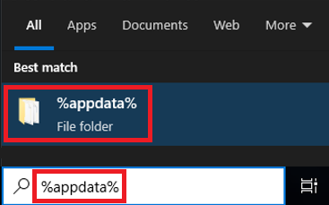
  &nbsp;
  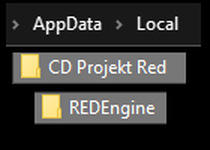

### If You Have Modded the Game Before

 1. Go to your main Cyberpunk 2077 directory and delete the `bin`, `engine`, `r6`, and `red4ext` folders.

    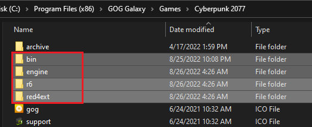

 2. Delete the `mod` folder in `Cyberpunk 2077\archive\pc\`.

    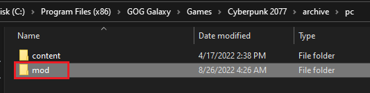

 3. Verify your game files through your launcher (Steam, GOG, Epic). This restores every core file you just deleted and guarantees a clean base for the list.

## Wabbajack Installation

### Installing Wabbajack

Once you have completed the pre-installation section, follow these steps to install Wabbajack:

 1. Create an empty folder named `Wabbajack` on the root of your drive, such as `C:\Wabbajack`.
    > - **DO NOT** place it in Program Files, in User folders (Desktop, Documents, Downloads, OneDrive, etc.), in your Cyberpunk 2077 game folder, or in any folder related to the modlist itself (the downloads or install folder).
    > - The `Wabbajack` folder does not need to be on an SSD, but it makes installing faster.

 2. Download the [latest version of Wabbajack](https://github.com/wabbajack-tools/wabbajack/releases/latest/download/Wabbajack.exe) and place `Wabbajack.exe` inside the folder you created in Step 1.

 3. Double-click `Wabbajack.exe` to set the program up.

### Downloading and Installing Night City Refined

>[!CAUTION]
>**A legal copy of Cyberpunk 2077 with Phantom Liberty is required.** Pirated copies of the game will cause the installation to fail.

Downloading and installing the list can take a while depending on your internet connection, PC specs, and whether you have Nexus Premium. Without Premium you will need to click the **Slow Download** button for each mod manually.

 1. Open Wabbajack and click `Settings` in the bottom left.

    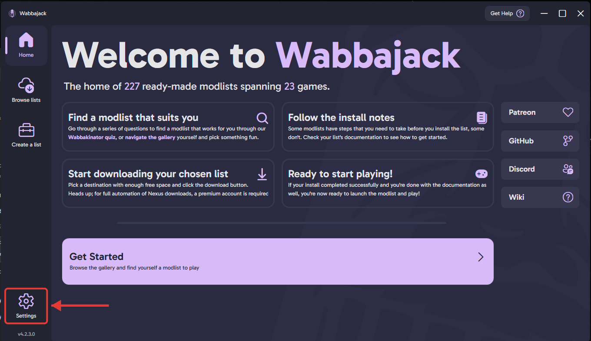

 2. Under **Logins**, click `Log in` beside **Nexus Mods** and sign in to your Nexus account. Once it is linked, the button reads `Logged in`. Every mod is pulled from Nexus, so this step is not optional.

    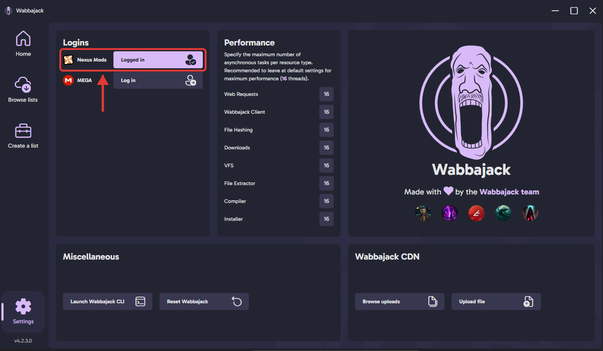

 3. Click `Browse lists`.
 4. Pick **Cyberpunk 2077** from the game filter drop-down box (or use the search bar to find **Night City Refined**).
 5. Press the download arrow on the Night City Refined card and wait for it to download.
 6. Set the `Installation Location` to a folder such as `C:\Night City Refined`.
    > - **DO NOT** place it in Program Files, in User folders (Desktop, Documents, Downloads, OneDrive, etc.), or in your Cyberpunk 2077 game folder.
    > - The `Downloads Location` does not need to be on an SSD, but it makes installing faster. Keeping it inside the install location, such as `C:\Night City Refined\Downloads`, is the easiest option.
 7. Press the `Install` button.
 8. Turn on your favorite show or a nice long video as Wabbajack does its thing. Alternatively, read through this ReadMe again.
 9. If the installation is successful, move on to [Post-Installation](#post-installation). If it is not, check the tips below or ask on the [Discord](https://discord.gg/teNx8uBpXt).

Installing from the .wabbajack file instead

If the list does not show up in the gallery, download [`Night City Refined.wabbajack`](https://github.com/BudddyDudeGuy/Night-City-Refined/releases/latest/download/Night.City.Refined.wabbajack) from the [Releases](https://github.com/BudddyDudeGuy/Night-City-Refined/releases/latest) page, select `Install from disk` in Wabbajack, and point it at that file. The rest of the steps are the same.

## Problems with Installation

It is possible that you may run into an error with Wabbajack while installing. Some common issues are listed below.

A download failed or the install stopped partway through!

This is almost always a hiccup on Nexus's end or with your connection, not a problem with the list. Run the install again with the exact same paths. Wabbajack keeps everything it has already downloaded and picks up where it left off.

Wabbajack couldn't find my game folder!

Make sure you own a legal copy of Cyberpunk 2077 with Phantom Liberty and REDmod installed, and that you have launched the game at least once. Then re-read the [Pre-Installation](#pre-installation-do-this-for-a-brand-new-clean-install) section.

My antivirus reports a virus with the program or modlist!

Windows 10/11 may quarantine a file that Wabbajack or Mod Organizer 2 needs. Add your `Wabbajack` folder and your modlist folder as exclusions in Windows Security, then run the install again.

Sanity check error extracting file:

Wabbajack will sometimes have issues extracting files if they use special characters. If you encounter this issue in a Wabbajack log, try the steps below:

 1. Press `Win Key + R`.
 2. Type `intl.cpl` and hit `ENTER`.
 3. Navigate to *Administrative* and click `Change system locale...`.
 4. Change the *Current system locale:* to `English (United Kingdom)`.
 5. **Uncheck** `Beta: Use Unicode UTF-8 for worldwide language support`.
 6. Click `OK`.
 7. **Restart your PC** and run the Wabbajack install again.

Wabbajack is crashing during the installation!

If Wabbajack keeps crashing, freezing, or blue-screening your PC, lower its resource usage:

 1. Open Wabbajack.
 2. Open Wabbajack's **Settings**.
 3. Under the **Performance** box, lower each number to half of what it is currently set to.
 4. Continue the installation.

## Post-Installation

>[!WARNING]
>Night City Refined requires a **new save**. It is not mid-save friendly: several mods rework the opening of the game and how the city unlocks, and adding them to an existing playthrough will break things. Start a new game when you first launch.

Before your first launch, open Mod Organizer 2 and scroll to the `READ TO ENABLE OR DISABLE BASED ON YOUR SETUP` separator. The mods in it depend on your hardware and settings, so go through them and tick or untick each one to match your PC.

 - **Path tracing, HDR, and keyboard mods ship disabled.** Several mods here are built only for path tracing, RenoDX is only for HDR, and Quickhack Hotkeys is only for mouse and keyboard. Enable the ones that match how you play.
 - **Use the notes.** Each mod in this separator has a note beside it in the Notes column that tells you when to enable or disable it.

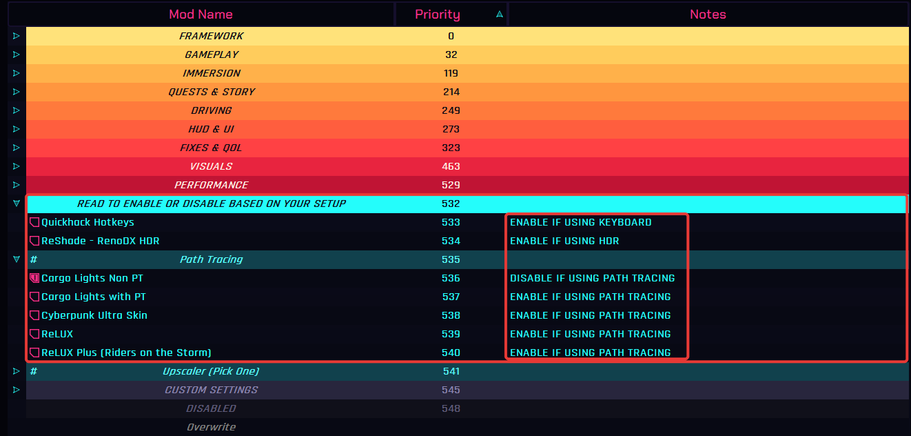

# Playing the List

Cyberpunk 2077 always has to be launched through Mod Organizer 2. Launching the game from Steam, GOG, Epic, or a desktop shortcut to the game executable will start it unmodded.

## Launching the Game

 1. Open your modlist folder and run `ModOrganizer.exe`.

 2. In the upper right of Mod Organizer 2 there is a dropdown menu beside the `RUN` button. Select `Cyberpunk 2077` and click `RUN`.

    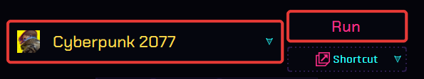

>[!CAUTION]
>A window will pop up with an `Unlock` button. **DO NOT click Unlock.** Give the game time to launch. Never click `Unlock` while playing the list, it will break the game.

>[!TIP]
>If you want a desktop shortcut, make it from the dropdown menu under the `RUN` button in MO2 rather than from the game executable.

<!-- REDprelauncher is not needed for this list. Mod Organizer 2 launches the game directly
     with "--launcher-skip -modded", which is what the "enable mods" tick box sets, and the
     REDmod cache is shipped prebuilt with the modlist so there is nothing to deploy.

 3. Once mod organizer is open, in the upper right of Mod organizer 2 you will see a dropdown menu beside the "RUN" button, select "REDprelauncher" and click the "RUN" button

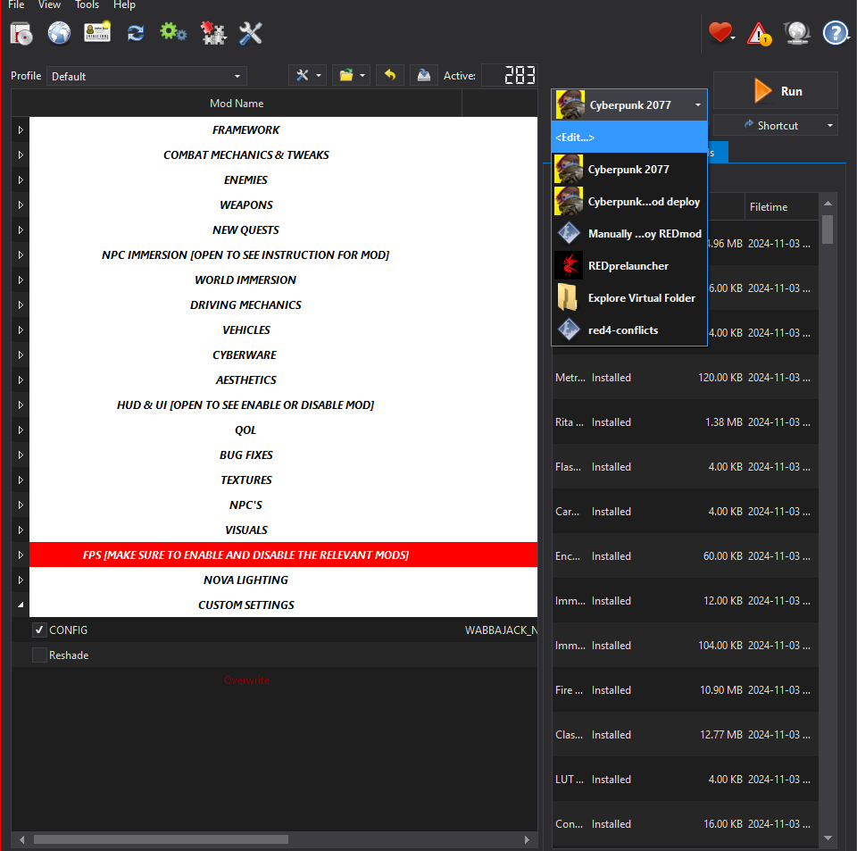

 4. Once "REDprelauncher" is open click the gear icon beside "Play" and click enable mods
-->

## First Time Game Startup

Once the pre-installation steps are done, launch the game and let it load to the main menu.

 1. Press the tilde key `~` to open the CET overlay.
    > The CET overlay is where you adjust mod settings, change lighting, and reach the game console. The keybind ships configured with this list, so you will not be prompted to assign one on first launch.

 2. Move and resize the CET windows however you like. Your layout is saved automatically for next time.

 3. 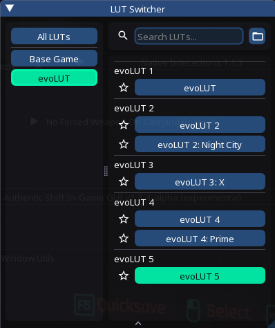 Pick your color grade in the `LUT Switcher` window. Select `evoLUT` on the left, then click any version on the right to apply it. They all look great, so choose whichever you like best. My personal favorites are evoLUT 1 and evoLUT 5.

    Your pick is saved and carries across saves and reloads. Star the ones you like to add them to your favorites, and if you want to flip between them quickly, the CET `Bindings` menu has hotkeys to toggle the active LUT or cycle through your favorites. A few quests and in-game effects briefly override the color grade, which is normal.

    > evoLUT's author recommends calibrating your display to a gamma of 2.2 and leaving the in-game **Gamma Correction** at `1.00` when playing in SDR.

     

 4. Press `~` again to close the overlay, then open your in-game settings and adjust the graphics to your liking.

 5. 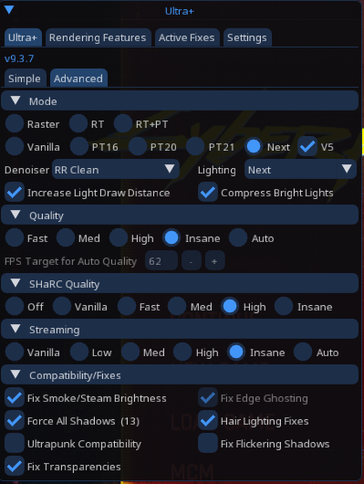 Open the overlay again and look for the `ULTRA+` window. Ultra Plus should have already set itself up automatically based on your in-game graphics settings, but check the values and adjust them to match your hardware. Your values will be different, but the panel should look something like the one on the right.

    > If you use DLSS Ray Reconstruction and the image looks smeary or wrong, switch the Ultra Plus **Denoiser** from `RR Clean` to `Vanilla`. According to the Ultra Plus authors, RR Clean needs an up to date version of DLSS.

     

 6. That's it, you're ready to play. Almost everything in the list can be adjusted to your taste in the `Mod Settings` menu on the main menu and pause menu, so feel free to look through it once you're in game.

>[!IMPORTANT]
>**Activate the romance message mods.** The first time you reach V's apartment in the H10 megabuilding (right after The Rescue), walk up to the TV and interact with it. You should get a confirmation popup for **Panam Romance Messages Extended** and **Judy Romance Messages Extended**, like the ones below. Without these popups the mods never switch on, and their extra messages with Panam and Judy will not show up.
>
>No popup? Leave the apartment, come back in, and interact with the TV again.

  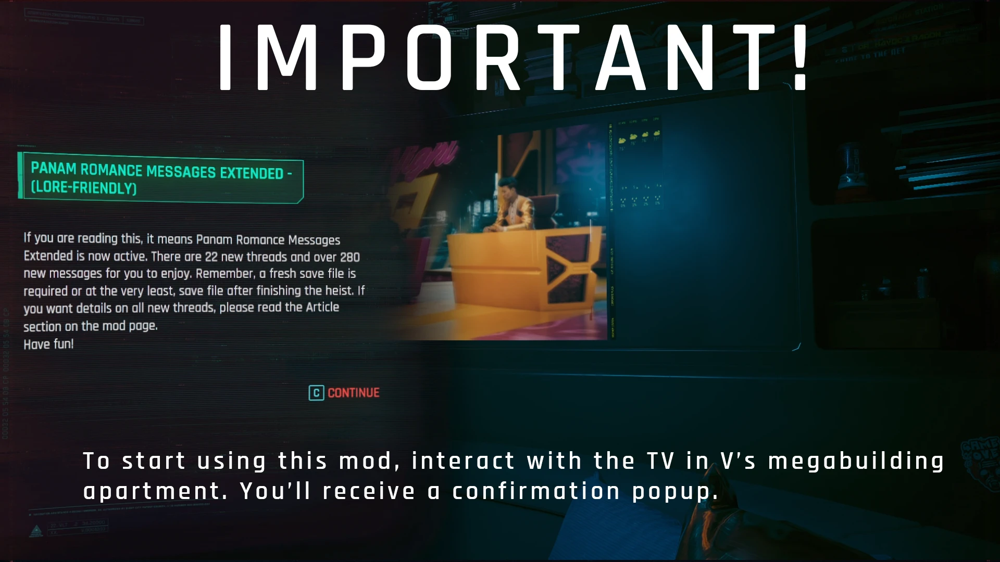
  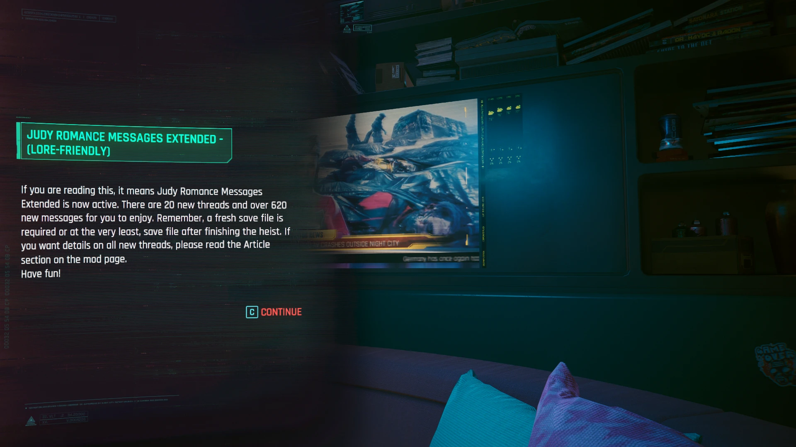

<!-- Pending assets. Re-enable once the screenshots are captured and committed to Images/.

### Controller Aiming

If you play on a gamepad and do not want the game to be trivially easy, copy the controller settings below. My brother and I ran these configurations over hundreds of hours of playtime, and they gave the best feel while keeping the game challenging.

(controller settings screenshot)

### Graphics Settings

(link to the graphics settings mod page)

If you have an RTX 4070 or better, you can copy my settings directly. My system is an RTX 4070 Ti Super with a Ryzen 7 7700X.

(graphics settings screenshot)
-->

# Updating the Modlist

Updating works the same way as installing. Open Wabbajack, find Night City Refined in `Browse lists`, and download the new version. Wabbajack remembers the paths from your original install, so just press `Install` and it will update your existing install in place.

Before updating, check the [Changelog](https://github.com/BudddyDudeGuy/Night-City-Refined/blob/main/Changelog.md) to see whether the update is **save-safe**. Most updates are, so you can keep playing your current save. If an update is not save-safe, finish or abandon your playthrough before updating and start a new game afterwards.

>[!WARNING]
>Any mods you added yourself will be deleted when updating. To keep them, prefix the mod name in MO2 with `[NoDelete]`.

# Removing the Modlist

Delete the folder the modlist is installed in. You can delete the downloads folder as well. That is the whole process, nothing is left behind elsewhere on your system.

# Issues

If you hit a bug, a crash, or something that just feels off, ask on the [Discord](https://discord.gg/teNx8uBpXt) or open a report on the [Issues](https://github.com/BudddyDudeGuy/Night-City-Refined/issues) page. Stability feedback, performance notes, and balance suggestions are all welcome.

To get a useful answer, please include:

 1. What you were doing when it happened, and whether you can reproduce it.
 2. Any relevant crash logs.
 3. Your hardware and graphics settings, including whether ray tracing or path tracing is enabled.

# Credits and Thanks

- *YOU* for reading this.
- [RelaxItsOk](https://next.nexusmods.com/profile/RelaxItsOk), [CyanideX](https://next.nexusmods.com/profile/theCyanideX), [deceptious](https://next.nexusmods.com/profile/deceptious), [ShinyaON](https://next.nexusmods.com/profile/ShinyaON), [MrFlashMode](https://next.nexusmods.com/profile/MrFlashMode), and [SammiLucia](https://next.nexusmods.com/profile/sammilucia) and the Ultra Plus team, whose work this list is built on.
- Q from Welcome to Night City, for taking the time to talk with me, share his thoughts, and help guide me through getting this modlist set up. Welcome to Night City was also a huge inspiration for this list.
- [aljo](https://next.nexusmods.com/profile/aljoxo) for [Apostasy](https://www.nexusmods.com/skyrimspecialedition/mods/118893), whose mod page and GitHub layout this list's description, README, and Gameplay Guide are modeled on.
- Every mod author whose work is included in this list. It would not exist without you.
- [CD Projekt Red](https://www.cdprojektred.com/) for Cyberpunk 2077 and REDmod.
- [Halgari](https://www.nexusmods.com/skyrimspecialedition/users/17252164) and the [Wabbajack](https://www.wabbajack.org/) team for the platform that makes one-click modlists possible.
- The Mod Organizer 2 team, and the authors of CET, RED4ext, redscript, TweakXL, and ArchiveXL, for the frameworks the entire Cyberpunk modding scene is built on.
- [Nexus Mods](https://www.nexusmods.com/) for hosting the mods that make up this list.
